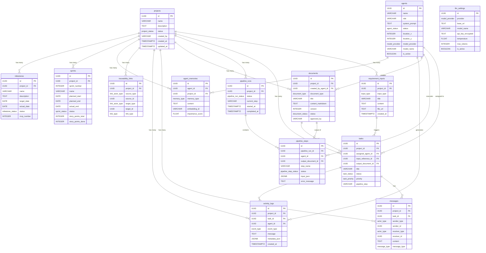

# Entity Relationship Diagram (ERD)

**Project:** AI-SDLC Working Office  
**Version:** 1.0.0  
**Date:** 2026-06-18  
**Database:** PostgreSQL 15+  
**Total Tables:** 14

---

## Entity Groups

| Group | Tables | Purpose |
|---|---|---|
| Core | `projects`, `requirement_inputs` | Project and input management |
| Agent | `agents`, `agent_memories` | Agent registry and memory |
| Pipeline | `pipeline_runs`, `pipeline_steps` | Execution tracking |
| Work | `tasks` | Task assignment and status |
| Output | `documents` | Agent-generated documents |
| Communication | `messages`, `activity_logs` | Agent chat and audit log |
| Traceability | `traceability_links` | Artifact linkage |
| Config | `llm_settings` | LLM provider configuration |
| Timeline | `sprints`, `milestones` | Sprint schedule and deadlines (FR-025–FR-029) |

---

## Mermaid ER Diagram

---

## Relationship Narrative

### projects (Root Entity)
`projects` is the anchor for all data. Every table (except `agents` and `llm_settings`) has a `project_id` FK. Deleting a project cascades to all child records.

### Requirement Flow
`requirement_inputs` → (triggers) `tasks` → (executes via) `pipeline_runs` → `pipeline_steps` → (produces) `documents`

### Agent Lifecycle
`agents` are globally registered (not per-project). They are assigned to `tasks`, execute `pipeline_steps`, create `documents`, and store context in `agent_memories`.

### Communication Layer
`messages` stores both agent handoff messages and user-to-agent chat. `activity_logs` is the append-only audit trail for the office activity feed.

### Traceability
`traceability_links` is a polymorphic many-to-many table. It can link any artifact type (`requirement_input`, `document`, `task`, `pipeline_step`) to any other, enabling full SDLC traceability.

### Timeline (Sprint 3 addition)
`sprints` and `milestones` support FR-025–FR-029: sprint schedule view, deadline alerts, and PM Agent reporting.

---

## Enum Types Summary

| Enum | Values |
|---|---|
| `project_status` | active, archived, completed |
| `input_type` | manual_text, meeting_transcript, chat_log, markdown_document, email_content, audio_transcript |
| `agent_status` | idle, working, done, error |
| `sprite_direction` | up, down, left, right |
| `model_provider` | ollama, openai |
| `task_status` | pending, in_progress, done, failed, cancelled |
| `task_priority` | low, medium, high, critical |
| `pipeline_run_status` | pending, running, completed, failed, cancelled |
| `pipeline_step_status` | pending, running, completed, failed, skipped |
| `document_type` | requirement_summary, gap_analysis_report, brd, fsd, user_story, architecture_doc, database_design, api_spec, screen_spec, test_cases, uat_script, change_impact_report, code_task_list |
| `document_status` | draft, review, approved, rejected, superseded |
| `actor_type` | agent, user, system |
| `message_type` | handoff, chat, notification, system |
| `event_type` | task_started, task_completed, task_failed, agent_moved, document_created, pipeline_step_started, pipeline_step_completed, handoff_sent, user_message |
| `link_type` | derived_from, implements, tests, conflicts_with |
| `link_actor_type` | requirement_input, document, task, pipeline_step |
| `memory_type` | context, decision, fact, instruction |
| `sprint_status` | not_started, in_progress, done, overdue |
| `milestone_status` | not_started, in_progress, done, overdue |
