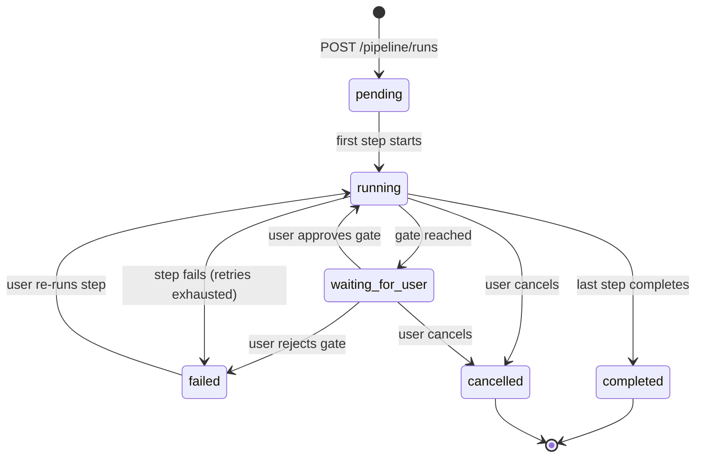
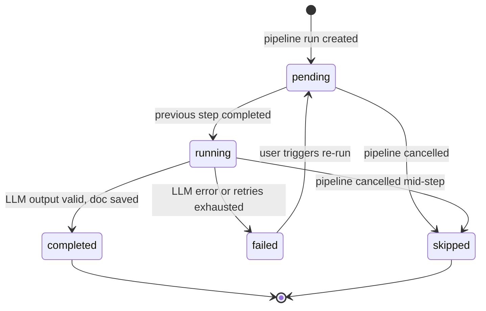
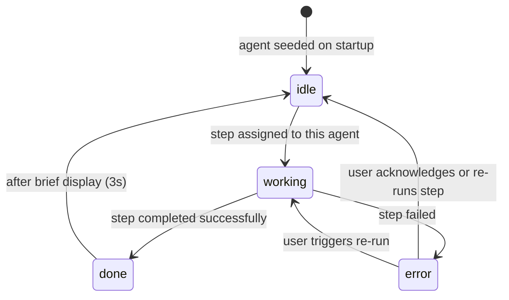
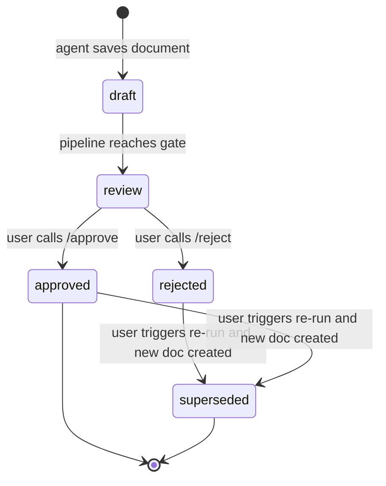

# Agent State Machine

**Project:** AI-SDLC Working Office  
**Version:** 1.0.0  
**Date:** 2026-06-18  
**Related:** `requirement-to-code.workflow.md`, `human-review-points.md`

---

## Overview

This document defines the state machines for three entities that drive the pipeline:

1. **Pipeline Run** — the overall execution lifecycle
2. **Pipeline Step** — each individual agent task within a run
3. **Agent** — the live status of an agent (used by the virtual office UI)
4. **Document** — the approval lifecycle of generated documents

---

## 1. Pipeline Run State Machine

### States

| State | Description |
|---|---|
| `pending` | Created, waiting for first step to start |
| `running` | At least one step is executing |
| `waiting_for_user` | Paused at a human review gate |
| `completed` | All steps finished successfully |
| `failed` | A step failed permanently |
| `cancelled` | User cancelled the run |

### Transitions

### Transition Rules

| From | To | Trigger | Side Effect |
|---|---|---|---|
| `pending` | `running` | Orchestrator starts step 1 | `pipeline_steps[0].status = running` |
| `running` | `waiting_for_user` | Step at a gate completes | Frontend shows review panel |
| `waiting_for_user` | `running` | User calls `/approve` | Next step begins |
| `waiting_for_user` | `failed` | User calls `/reject` | Current step `status = failed` |
| `running` | `completed` | Final step completes | All docs finalized, traceability updated |
| `running` | `failed` | Retries exhausted | `pipeline_steps[N].status = failed` |
| `failed` | `running` | User calls `/rerun` | Step reset to `pending`, then `running` |
| `running` | `cancelled` | User cancels | In-flight step receives stop signal |

---

## 2. Pipeline Step State Machine

### States

| State | Description |
|---|---|
| `pending` | Queued, waiting for previous step to complete |
| `running` | Agent is currently executing this step |
| `completed` | Agent finished, output document created |
| `failed` | Error occurred, `error_message` recorded |
| `skipped` | Run was cancelled before this step started |

### Transitions

### Transition Rules

| From | To | Trigger | DB Change |
|---|---|---|---|
| `pending` | `running` | Orchestrator picks up step | `started_at = now()` |
| `running` | `completed` | LLM output saved as document | `completed_at = now()`, `output_document_id = <id>` |
| `running` | `failed` | Exception or retries exhausted | `error_message = <reason>`, `retry_count` updated |
| `failed` | `pending` | User calls `/rerun` | `error_message = null`, `started_at = null` |
| `pending` | `skipped` | Pipeline cancelled | — |
| `running` | `skipped` | Pipeline cancelled | — |

---

## 3. Agent Status State Machine

The agent status reflects what the agent is doing right now. It is displayed in the virtual office UI as a status badge and drives avatar animation.

### States

| State | Description | UI Display |
|---|---|---|
| `idle` | No active task, waiting for assignment | Avatar standing still |
| `working` | Executing a pipeline step | Avatar animated (typing/thinking) |
| `done` | Just completed a step (brief state before returning to idle) | Avatar with check badge |
| `error` | Step failed, agent in error state | Avatar with error badge |

### Transitions

### Transition Rules

| From | To | Trigger | DB Change |
|---|---|---|---|
| `idle` | `working` | Orchestrator assigns step | `status = working`, `current_zone = active_zone` |
| `working` | `done` | Step completes | `status = done` |
| `working` | `error` | Step fails | `status = error` |
| `done` | `idle` | 3-second display timeout | `status = idle`, `current_zone = home_zone` |
| `error` | `idle` | User acknowledges error | `status = idle` |
| `error` | `working` | User triggers step re-run | `status = working` |

### Agent Position Rules

- On `idle → working`: agent moves from `home_zone` to `active_zone` (animated via WebSocket `agent_moved` event)
- On `done/error → idle`: agent returns to `home_zone`
- Position (`location_x`, `location_y`) is updated in `agents` table after each move
- WebSocket broadcasts `agent_status_changed` and `agent_moved` events to all connected clients

---

## 4. Document Status State Machine

Generated documents go through an approval lifecycle independent of, but linked to, the pipeline step.

### States

| State | Description |
|---|---|
| `draft` | Just created by agent, not yet reviewed |
| `review` | Sent to human for review (at a gate) |
| `approved` | Human approved — unlocks downstream agents |
| `rejected` | Human rejected — step must be re-run |
| `superseded` | A newer version of this document exists |

### Transitions

### Transition Rules

| From | To | Trigger | DB Change |
|---|---|---|---|
| `draft` | `review` | Pipeline reaches review gate | `status = review` |
| `review` | `approved` | User approves via `/approve` | `status = approved`, `approved_by`, `approved_at` |
| `review` | `rejected` | User rejects via `/reject` | `status = rejected`, `rejection_reason` |
| `rejected` | `superseded` | Step re-run produces new doc | old doc `status = superseded` |
| `approved` | `superseded` | Step re-run produces new doc | old doc `status = superseded` |

---

## 5. WebSocket Events Reference

The following events are broadcast to clients connected to `/ws/{project_id}`:

| Event | When | Payload Fields |
|---|---|---|
| `pipeline_run_status_changed` | Run status transitions | `run_id`, `old_status`, `new_status` |
| `pipeline_step_status_changed` | Step status transitions | `run_id`, `step_id`, `step_name`, `old_status`, `new_status` |
| `pipeline_step_completed` | Step completes | `run_id`, `step_id`, `step_name`, `output_document_id` |
| `human_review_required` | Pipeline pauses at gate | `run_id`, `step_id`, `gate_name`, `document_ids` |
| `agent_status_changed` | Agent status transitions | `agent_id`, `agent_name`, `old_status`, `new_status`, `message` |
| `agent_moved` | Agent changes position | `agent_id`, `from_x`, `from_y`, `to_x`, `to_y` |
| `document_status_changed` | Document approved/rejected | `document_id`, `document_type`, `old_status`, `new_status` |

---

## 6. Orchestrator Responsibilities

The orchestrator is the backend service (`app/services/orchestrator.py`) that:

1. Monitors `pipeline_steps` for `pending` steps whose predecessor is `completed`
2. Constructs the handoff payload from DB state
3. Invokes the agent (calls the LLM via the agent's system prompt + task prompt)
4. Saves the LLM output as a new `documents` record
5. Updates `pipeline_steps.status` and `pipeline_runs.status`
6. Publishes WebSocket events after each state change
7. Applies retry logic on LLM failure
8. Halts at human review gates by setting `pipeline_runs.status = waiting_for_user`
